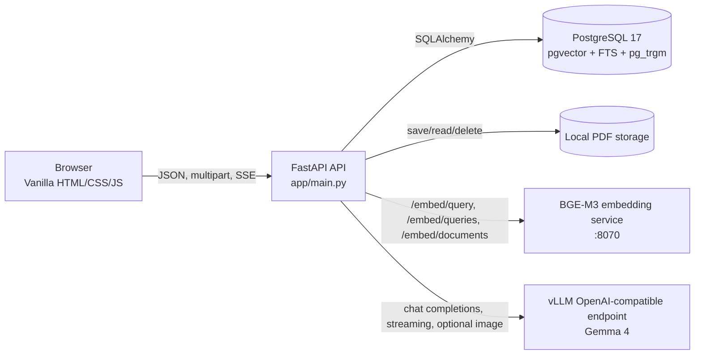
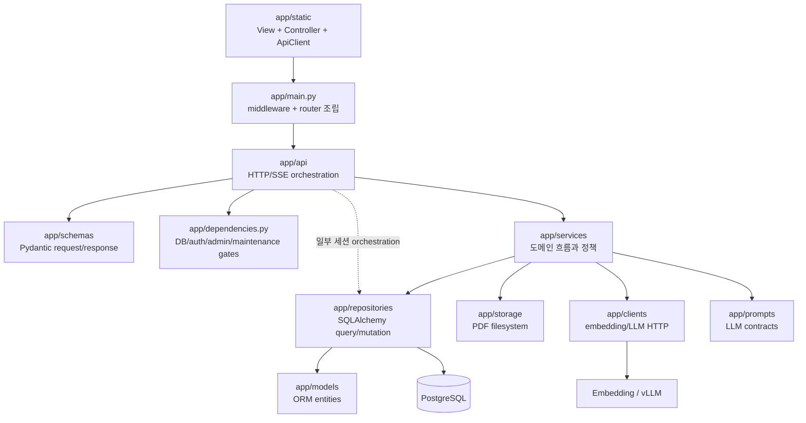
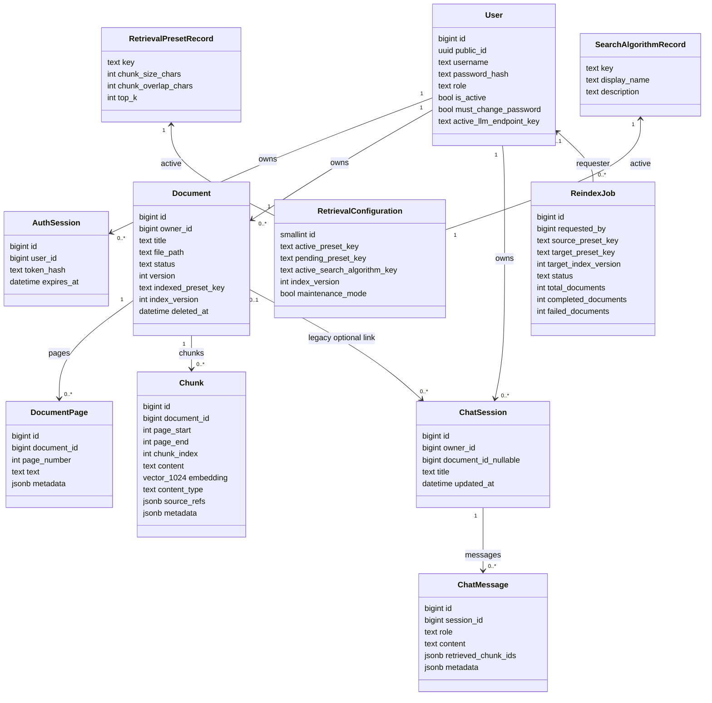
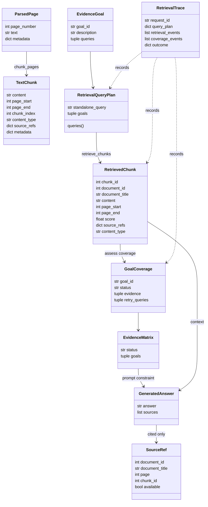
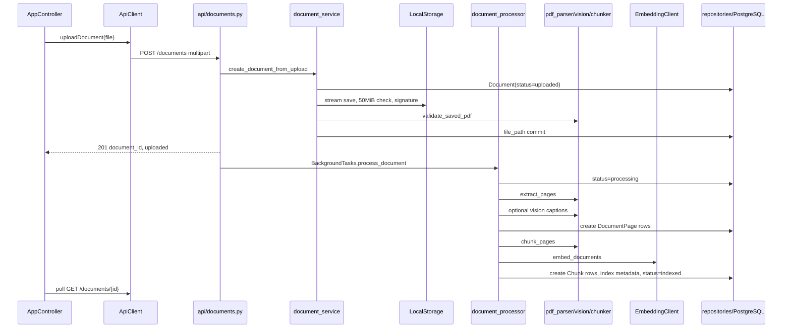
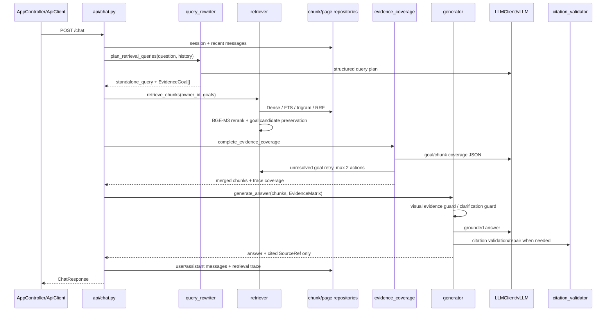
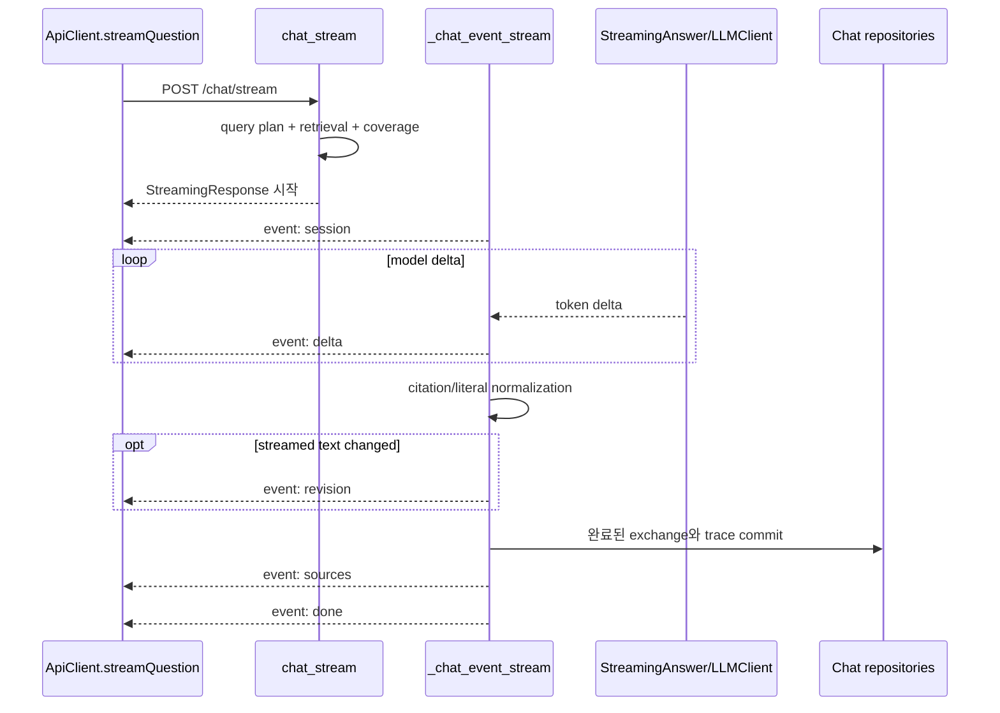
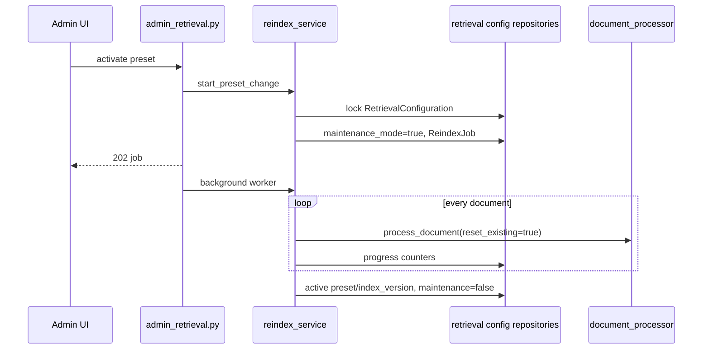
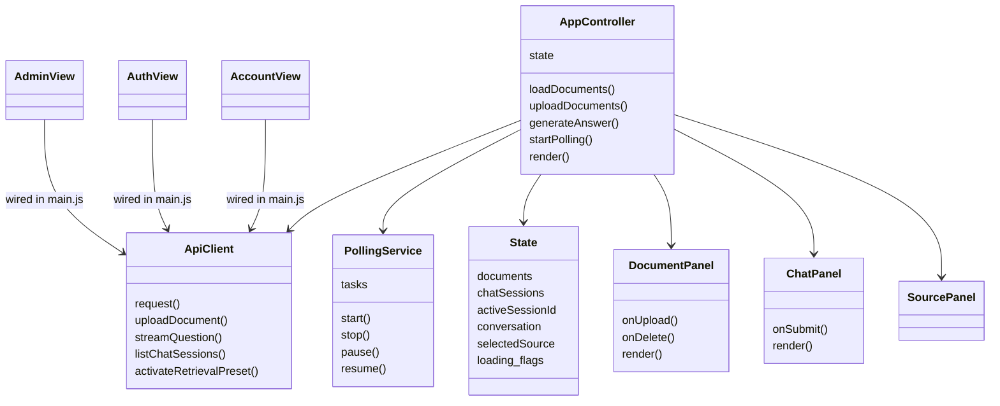

# miniNBLM 코드베이스 구조·변경 가이드

이 문서는 코드를 처음 읽는 사람이 다음 질문에 답할 수 있도록 작성한 지도다.

1. 요청이 어느 파일에서 시작해 어디까지 흐르는가?
2. 주요 클래스와 데이터 모델은 어떻게 연결되는가?
3. 기능을 추가하거나 동작을 수정할 때 어떤 파일을 함께 바꿔야 하는가?
4. 문제를 재현하고 검증하려면 어떤 순서로 코드를 읽고 테스트해야 하는가?

현재 운영 기준은 `main`의 embedding 기반 RAG다. 전용 cross-encoder 구현과 A/B 평가 자산은
`experiment/cross-encoder-reranker` branch에만 있다. 일반 기능을 수정할 때는 `main`을
기준으로 읽는다.

---

## 1. 한 문장으로 보는 시스템

사용자별 PDF를 PostgreSQL·pgvector에 페이지와 chunk로 인덱싱하고, 질문을 원자적 근거
목표로 분해하여 Dense/FTS/pg_trgm/RRF 검색과 제한된 재검색을 수행한 뒤, Gemma 4가
실제로 인용한 Source/Page만 반환하는 FastAPI + Vanilla JavaScript RAG 서비스다.

---

## 2. 실행 컴포넌트



논리 서비스는 `api`, `db`, `embedding`, `llm` 네 개다. 배포 방식은 달라도 코드 계약은
같다.

- 4-container Compose: `docker-compose.yml`
- 단일 all-in-one container: `Dockerfile.all-in-one`, `docker-compose.all-in-one.yml`
- Docker 없는 native 실행: `run-native.sh`
- 브라우저 UI: `app/static/`; 별도 프런트엔드 build step 없음

외부 모델 weight는 image에 포함하지 않는다. all-in-one은 `/data/models/gemma4`의 설치된
모델을 재사용한다.

---

## 3. 코드 계층과 의존 방향

이 저장소는 엄격한 Clean Architecture가 아니라 **실용적인 계층 구조**다. 새 기능은
인접 코드의 기존 방향을 따르고 두 번째 패턴을 만들지 않는다.



### 계층별 책임

| 계층 | 책임 | 넣지 말아야 할 것 |
|---|---|---|
| `app/api/` | HTTP status, dependency, request/response, SSE lifecycle | 복잡한 SQL, PDF parsing 구현 |
| `app/schemas/` | 외부 API DTO와 validation | DB transaction, 서비스 호출 |
| `app/services/` | 여러 repository/client를 묶는 유스케이스와 정책 | HTTP cookie/header 세부 구현 |
| `app/repositories/` | 소유권 조건을 포함한 SQLAlchemy 접근 | HTTPException, LLM 호출 |
| `app/models/` | DB schema와 relationship | API 표현 형식 |
| `app/clients/` | 외부 HTTP SDK·timeout·batch 계약 | 비즈니스 fallback 전체 흐름 |
| `app/prompts/` | 모델이 따라야 하는 출력·근거 계약 | Python parser와 다른 별도 schema |
| `app/static/` | 브라우저 상태, DOM, API/SSE 소비 | 서버 권한 판정 |

예외적으로 `app/api/chat.py`는 session lifecycle과 RAG orchestration이 크기 때문에
`chat_repository`를 직접 호출한다. 이를 수정할 때만 이 기존 패턴을 따르고, 다른 새
router에서 repository 직접 호출을 기본 패턴으로 복제하지 않는다.

---

## 4. 진입점과 공통 요청 처리

### 4.1 API 시작

`app/main.py`가 조립점(composition root)이다.

1. `Settings`를 import 시점에 로드한다: `app/config.py`
2. FastAPI lifespan에서 JSON logging을 설정한다.
3. `runtime_service.initialize_runtime()`를 실행한다.
4. bootstrap 관리자, 중단된 reindex job, 중단된 문서를 복구한다.
5. router와 `/static`을 mount한다.

설정은 import 시점에 고정되므로 `.env` 또는 endpoint JSON 변경 뒤에는 API 재시작이
필요하다.

### 4.2 middleware

routing 전에 다음 보호·관측 계층을 통과한다.

- `RequestBodyLimitMiddleware`: 전체 HTTP body 51MiB 상한
- `RequestObservabilityMiddleware`: request ID, HTTP count/latency, JSON log
- 정적 자산 no-cache middleware

PDF 파일 자체 상한은 별도로 50MiB다. 전체 multipart body 상한과 파일 상한을 같은
값으로 만들면 multipart overhead 때문에 정상적인 50MiB PDF가 거절될 수 있다.

### 4.3 dependency gate

`app/dependencies.py`가 공통 권한 경계다.

- `get_authenticated_user`: cookie token 확인
- `get_current_user`: 최초 비밀번호 변경 강제
- `get_current_user_with_language_model`: 사용자 endpoint를 ContextVar에 설정
- `get_current_admin`: `role == "admin"`
- `ensure_retrieval_writes_available`: reindex maintenance 중 write/chat 차단

인증·소유권 검사를 router마다 수동 복제하지 말고 이 dependency와 owner-filtered
repository를 사용한다.

### 4.4 API 지도

| URL prefix | Router | 주 책임 |
|---|---|---|
| `/auth` | `app/api/auth.py` | 가입, 로그인, 비밀번호, 탈퇴, 현재 사용자 |
| `/documents` | `app/api/documents.py` | PDF 업로드, 목록, 상태, 원본, 삭제 |
| `/chat` | `app/api/chat.py` | session, 동기 답변, SSE 답변 |
| `/language-models` | `app/api/language_models.py` | 허용 endpoint 조회와 사용자 선택 |
| `/admin/users` | `app/api/admin_users.py` | 관리자 비밀번호 초기화 |
| `/admin/retrieval` | `app/api/admin_retrieval.py` | preset, 알고리즘, reindex job, trace |
| `/health` | `app/api/health.py` | process 및 통합 readiness |
| `/metrics` | `app/api/metrics.py` | Prometheus exposition |

---

## 5. 데이터 모델 클래스 다이어그램



### 모델을 읽을 때 주의할 점

- 일반 작업공간 chat session은 `document_id=NULL`이다. 특정 문서를 선택하는 구조가 아니다.
- 검색은 항상 로그인 사용자의 모든 `indexed` 문서를 대상으로 한다.
- `Chunk.embedding`은 1024차원 BGE-M3 vector다.
- `Chunk.content_type`은 현재 `text` 또는 `vision_caption`이다.
- `source_refs`와 page metadata가 Source/Page 및 visual guard의 provenance다.
- ORM field를 바꾸면 `app/models/`만 수정해서는 안 된다. Alembic migration이 반드시 필요하다.
- `Document.version`은 완전한 문서 버전 이력 기능이 아니다.

---

## 6. RAG 런타임 객체 다이어그램

ORM 외에 검색·추론 경계를 전달하는 immutable dataclass가 중요하다.



이 객체의 필드 계약을 바꾸면 producer, consumer, trace serialization, prompt, 테스트를
같이 수정해야 한다.

---

## 7. 주요 요청 흐름

### 7.1 PDF 업로드와 인덱싱



#### 관련 파일

- HTTP: `app/api/documents.py`
- 문서 lifecycle: `app/services/document_service.py`
- 파일 저장: `app/storage/local_storage.py`
- PDF 구조 검사: `app/services/upload_validation.py`
- parsing: `app/services/pdf_parser.py`
- Vision: `app/services/page_renderer.py`, `vision_captioner.py`
- chunk: `app/services/chunker.py`
- embedding: `app/clients/embedding_client.py`, `embedding_service/main.py`
- DB: `document_repository.py`, `page_repository.py`, `chunk_repository.py`
- 중단 복구: `runtime_service.py`, `document_recovery_service.py`
- UI polling: `app-controller.js`, `polling-service.js`, `document-panel.js`

현재 인덱싱은 durable queue가 아니라 FastAPI background task 또는 daemon thread다. API
재시작 복구는 있지만 중간 단계 checkpoint queue는 없다.

### 7.2 동기 RAG 질문



#### 검색 단계의 실제 순서

1. 최근 대화에서 검색용 독립 질문과 최대 4개 원자적 `EvidenceGoal`을 만든다.
2. 현재 active search algorithm을 DB에서 읽는다.
3. Dense/Keyword/Substring/Hybrid를 실행한다.
4. 여러 query 결과는 RRF와 query anchor 보존으로 합친다.
5. Dense/Hybrid는 BGE-M3 cosine으로 재정렬한다.
6. goal마다 가장 좋은 후보를 최소 하나 보존한다.
7. 인접 chunk를 제한된 크기로 확장한다.
8. coverage가 부족하면 unresolved goal만 검색한다.
9. 필요하면 page FTS/trigram → page와 겹치는 chunk의 hierarchical fallback을 수행한다.
10. 추가 retrieval action은 전체 합계 최대 2회다.
11. 답변 생성 전 Evidence Matrix가 가리킨 chunk를 우선하고 서로 다른 page를 보존하면서
    formatted Context를 최대 14,000자로 제한한다.
12. endpoint가 context/output 합계 초과를 반환하면 남은 window 범위에서 output token을
    한 번만 줄여 재시도한다.

#### 검색 코드를 수정할 때 같이 볼 파일

- 계획: `app/services/query_rewriter.py` +
  `app/prompts/retrieval_query_rewriter_system_prompt.txt`
- 검색 orchestration: `app/services/retriever.py`
- 재정렬: `app/services/reranker.py`
- SQL: `app/repositories/chunk_repository.py`, `app/repositories/page_repository.py`
- page fallback: `app/services/hierarchical_retriever.py`
- coverage: `app/services/evidence_coverage.py` + `app/prompts/evidence_coverage_system_prompt.txt`
- trace: `app/services/retrieval_trace.py`
- 답변 context: `app/services/prompt_builder.py`
- 답변/후처리: `app/services/generator.py`, `app/services/citation_validator.py`,
  `app/services/evidence_guard.py`

### 7.3 SSE 질문

`POST /chat/stream`은 검색까지 동기 경로와 같다. 차이는 생성과 저장 lifecycle이다.



중요 invariant:

- 완료된 답변만 저장한다.
- 신규 session에서 stream 실패·취소가 발생하고 message가 없으면 session을 정리한다.
- `NO_SOURCE` marker는 사용자에게 노출하지 않는다.
- 후처리 결과가 이미 보낸 delta와 다르면 `revision` event가 최종 정답이다.
- 프런트엔드는 `delta`, `revision`, `sources`, `done`, `error`를 모두 처리해야 한다.

### 7.4 인증

```text
cookie token
  -> SHA-256 token_hash
  -> AuthSession lookup + expires_at
  -> get_authenticated_user
  -> must_change_password gate
  -> role/admin gate
```

- cookie 설정/삭제와 HTTP status: `app/api/auth.py`
- 비밀번호·session·탈퇴 정책: `app/services/auth_service.py`
- password policy: `app/password_policy.py`
- SQL: `app/repositories/user_repository.py`
- DTO: `app/schemas/auth.py`
- UI: `app/static/js/views/auth-view.js`, `app/static/js/views/password-change-view.js`,
  `app/static/js/views/account-view.js`, `app/static/js/main.js`

### 7.5 preset 변경과 전체 재인덱싱



검색 알고리즘만 바꾸면 reindex하지 않는다. chunk size/overlap이 바뀌면 모든 문서를
다시 처리한다. 이 판단은 `retrieval_presets.plan_preset_change()`에 있다.

---

## 8. 프런트엔드 구조



### 프런트엔드 역할

- `app/static/index.html`: DOM skeleton과 접근성 label
- `app/static/js/main.js`: 객체 생성, view event wiring, 인증/관리자/모델 선택 화면 전환
- `app/static/js/state.js`: 상태 shape와 작은 pure update helper
- `app/static/js/api-client.js`: 모든 HTTP/SSE 계약과 사용자용 오류 메시지
- `app/static/js/app-controller.js`: 문서·대화·업로드·질문 use case와 render 조정
- `app/static/js/views/*.js`: DOM render와 callback 등록; 서버 호출을 직접 하지 않음
- `app/static/js/polling-service.js`: 문서 상태 polling timer lifecycle
- `app/static/styles/tokens.css`: 색·간격·타이포 토큰
- `app/static/styles/layout.css`: 화면 구조와 responsive layout
- `app/static/styles/components.css`: 컴포넌트 상태

새 UI 기능은 보통 `app/static/index.html → view → main.js wiring → AppController/ApiClient
→ CSS` 순서로 수정한다. View에서 직접 `fetch()`하는 두 번째 API 패턴을 만들지 않는다.

---

## 9. 기능별 수정 위치 지도

| 원하는 변경 | 첫 수정 위치 | 함께 확인할 위치 | 필수 검증 |
|---|---|---|---|
| 새 HTTP endpoint | `app/api/<domain>.py` | `app/schemas/`, `app/services/`, `app/main.py` router include | integration API test |
| request/response field 추가 | `app/schemas/` | router mapping, `app/static/js/api-client.js`, view/controller | schema + integration + UI smoke |
| DB column/table 추가 | `app/models/` | `alembic/versions/`, repository, schema | migration upgrade + integration |
| 사용자 소유 데이터 추가 | repository owner filter | service, account deletion cascade | 두 사용자 격리 test |
| 회원가입/login 정책 | `app/services/auth_service.py` | `app/password_policy.py`, auth schema/API/UI | auth integration tests |
| cookie 동작 | `app/api/auth.py` | `app/config.py`, `.env.example` | response cookie flags test |
| PDF validation | `app/services/upload_validation.py`, `app/storage/local_storage.py` | `app/api/documents.py`, request limit, UI 50MiB constant | invalid/oversize cleanup test |
| PDF text 순서·표 추출 | `app/services/pdf_parser.py` | `ParsedPage.metadata`, `app/services/chunker.py`, fixtures | parser fixture + reindex benchmark |
| chunk 크기/overlap | `app/retrieval_presets.py` | seed migration, reindex plan, admin UI | preset + reindex tests |
| 새 검색 알고리즘 | `app/search_algorithms.py` | DB seed migration, `app/services/retriever.py`, repository SQL, admin UI | algorithm integration/recall |
| 검색 query 분해 | `app/prompts/retrieval_query_rewriter_system_prompt.txt`, `app/services/query_rewriter.py` | `EvidenceGoal`, chat orchestration, trace | malformed JSON + multi-goal tests |
| 검색 후보 조합 | `app/services/retriever.py` | `app/services/reranker.py`, repositories, hierarchical fallback | recall/MRR fixture |
| BGE-M3 scoring | `app/services/reranker.py` | `EmbeddingClient`, goal reservation | reranker unit + retrieval benchmark |
| 근거 충족 판정 | `app/prompts/evidence_coverage_system_prompt.txt`, `app/services/evidence_coverage.py` | trace, hierarchical retriever, prompt builder | invalid ID/fallback/bounded retry |
| 답변 정책 | `app/prompts/rag_system_prompt.txt` | `app/services/prompt_builder.py`, generator | observable answer contract tests |
| NO_SOURCE/시각 거부 | `app/services/evidence_guard.py`, `app/services/generator.py` | vision metadata, SSE normalizer | source empty + visual-only cases |
| 인용 형식·보정 | `app/services/citation_validator.py` | generator, SourceRef mapping, SSE revision | sentence/Page/source tests |
| 대화 저장/pagination | `app/repositories/chat_repository.py` | chat model/schema/API/controller | integration + pagination |
| LLM endpoint 추가 | `config/llm-endpoints*.json` | `app/config.py`, language model service/API/UI | config validation + `/models` check |
| Vision caption | `app/services/vision_captioner.py` | page renderer, parser metadata, chunker, guard, endpoint capability | repeated visual fixture |
| readiness | `app/services/readiness_service.py` | health schema/API, Compose healthcheck | component failure tests |
| metric/log 추가 | `app/observability.py` | operation callsite, `/metrics` | label/status test |
| upload request 상한 | `app/request_limits.py`, `app/config.py` | Compose/env, `LocalStorage`, UI limit | Content-Length + chunked test |
| 관리자 preset UI | `app/static/js/views/admin-view.js`, `app/static/js/main.js` | `ApiClient`, admin API/schema | API integration + UI smoke |
| 문서 UI | `app/static/js/views/document-panel.js`, `app/static/js/app-controller.js` | polling, API client, CSS | upload/delete/error/mobile smoke |
| 채팅 UI/SSE | `app/static/js/views/chat-panel.js`, `app/static/js/app-controller.js` | `ApiClient.streamQuestion`, source panel | delta/revision/error/retry smoke |
| Docker runtime | Dockerfile/Compose | env examples, entrypoint, operations docs | config + build + readiness |
| all-in-one release | `Dockerfile.all-in-one`, Compose env | version label, 12B/31B configs, docs | both builds + remote digest |

### DB 변경 체크리스트

1. ORM model 수정
2. 새 Alembic revision 생성
3. PostgreSQL extension/index/constraint 확인
4. repository query와 owner filter 수정
5. API schema가 필요한지 확인
6. account/document 삭제 경로 확인
7. 기존 데이터 backfill/default 확인
8. 격리 DB integration test 실행

`Base.metadata.create_all()`에 기대지 않는다. 운영 schema source of truth는 Alembic이다.

### Prompt 변경 체크리스트

1. prompt가 요구하는 JSON key/status를 Python parser와 일치시킨다.
2. raw model output의 fence, 잘린 JSON, key 손상을 고려한다.
3. 알 수 없는 goal ID/chunk ID를 위치로 추측하지 않는다.
4. fallback이 기존 Context를 지우지 않는지 확인한다.
5. sync와 streaming 결과가 같은 최종 answer/source를 갖는지 확인한다.
6. 실제 Gemma 반복 fixture로 deterministic failure와 stochastic failure를 분리한다.

---

## 10. 코드 읽기 추천 순서

### 10.1 전체 구조를 60분 안에 파악

1. `app/main.py`
2. `app/config.py`
3. `app/dependencies.py`
4. `app/models/*.py`
5. `app/api/documents.py`
6. `app/services/document_service.py`
7. `app/services/document_processor.py`
8. `app/api/chat.py`의 `chat()`과 `chat_stream()`
9. `query_rewriter.py → retriever.py → evidence_coverage.py → generator.py`
10. `app/static/js/main.js → app-controller.js → api-client.js`

처음부터 `generator.py`의 모든 regex를 읽지 않는다. 먼저 호출 순서와 dataclass 경계를
잡고, 실패 사례를 볼 때 해당 normalizer를 내려간다.

### 10.2 검색 품질 문제를 파악

1. 실패 질문의 retrieval trace를 확인한다.
2. query plan의 `goal_id`, description, queries를 확인한다.
3. `retrieval_events`에서 initial/targeted/hierarchical 후보를 비교한다.
4. `coverage_events`에서 supported/missing 상태와 chunk ID를 확인한다.
5. 정답 페이지가 후보에 없으면 repository/retriever 문제다.
6. Context에는 있는데 답변에서 빠지면 prompt/generator 문제다.
7. 답변은 맞고 source만 틀리면 citation 문제다.

파일 순서:

```text
app/services/query_rewriter.py
  -> app/services/retriever.py
    -> app/repositories/chunk_repository.py / page_repository.py
    -> app/services/reranker.py
    -> app/services/hierarchical_retriever.py
  -> app/services/evidence_coverage.py
  -> app/services/prompt_builder.py
  -> app/services/generator.py
  -> app/services/citation_validator.py
```

### 10.3 업로드·인덱싱 실패를 파악

```text
app/api/documents.py
  -> app/services/document_service.py
    -> app/storage/LocalStorage
    -> app/services/upload_validation.py
  -> app/services/document_processor.py
    -> app/services/pdf_parser.py
    -> app/services/vision_captioner.py
    -> app/services/chunker.py
    -> app/clients/EmbeddingClient
    -> app/repositories/page/chunk/document repositories
```

DB `documents.status`와 `error_message`, 원본 `file_path`, page/chunk row 개수를 먼저
확인한다. 실패 증상을 UI polling에서 고치지 말고 processor의 최초 실패 지점을 고친다.

### 10.4 UI 문제를 파악

1. `app/static/index.html`에 필요한 element ID가 있는지 확인
2. `app/static/js/main.js`에서 View와 callback이 연결됐는지 확인
3. `AppController` state transition 확인
4. `ApiClient` path/payload/SSE event 확인
5. View의 render 분기 확인
6. layout → component CSS 순서로 확인

서버 응답을 임시로 DOM에서 보정하지 않는다. 계약 오류면 schema/API/ApiClient를 함께
수정한다.

---

## 11. 불변조건과 자주 생기는 실수

### 사용자 격리

- 문서·대화·검색 query는 반드시 `owner_id`로 제한한다.
- 관리자 endpoint만 `get_current_admin`을 사용한다.
- 새 repository query에 owner join을 빠뜨리면 심각한 데이터 유출이다.

### Transaction

대부분 repository는 `flush()`까지만 하고 service/router가 `commit()`한다. 일부 기존
함수는 내부 commit을 수행하므로 호출 전에 구현을 확인한다. 새 코드는 transaction
경계를 유스케이스 단위로 한 곳에 둔다.

### 검색과 출처

- 검색 후보 전체를 source로 반환하지 않는다.
- 최종 답변이 실제 인용한 Source 번호만 `SourceRef`로 변환한다.
- 문서 삭제 뒤 과거 source label은 보존하되 `available=false`가 될 수 있다.
- `Source N`은 현재 Context list의 1-based index다.
- 생성 Context는 `prompt_builder.select_generation_chunks()`가 근거 chunk와 page
  다양성을 우선해 14,000자로 제한한다. Source 번호와 citation mapping에는 선택된
  동일 chunk list를 사용해야 한다.

### 재인덱싱

- chunk schema나 page metadata 의미가 바뀌면 기존 문서는 자동 갱신되지 않는다.
- preset의 chunk size/overlap 변경은 전체 재인덱싱 대상이다.
- maintenance 중 문서 write/chat 요청은 503이 될 수 있다.

### 설정

- `settings`는 import 시 만들어진다. 테스트는 monkeypatch 경계를 명확히 한다.
- LLM endpoint JSON은 시작 시 전체 검증된다.
- Vision caption을 켜려면 endpoint `supports_vision=true`가 필요하다.

### Background work

- 문서 처리와 reindex는 영속 queue가 아니다.
- 여러 API replica를 바로 늘리면 중복 복구·작업 claim 문제가 생긴다.
- 이 영역을 확장할 때는 PostgreSQL job claim/lease 또는 별도 queue를 먼저 설계한다.

### Frontend

- UI는 Vanilla JS이며 React가 없다.
- `main.js`는 wiring, `AppController`는 유스케이스, View는 DOM 책임이다.
- polling timer는 화면 전환·unload에서 정리해야 한다.
- 50MiB 제한은 UI 사전검사일 뿐이며 서버 제한이 source of truth다.

### Branch

- `main`: embedding 기반 운영 코드
- `experiment/cross-encoder-reranker`: 전용 cross-encoder와 A/B fixture
- 일반 기능을 실험 branch에서 수정하고 main으로 누락시키지 않는다.

---

## 12. 테스트 선택 가이드

| 변경 종류 | 최소 테스트 |
|---|---|
| pure parser/dataclass | 해당 `tests/unit/test_*.py` |
| repository/API/model | `./scripts/test.sh -q`의 integration 포함 |
| upload 제한 | `test_request_limits.py`, `test_document_api.py` |
| 검색 순위 | retriever/reranker unit + retrieval benchmark |
| goal/coverage | query rewriter + evidence coverage + chat integration |
| answer/citation | generator + streaming generator + citation validator |
| auth/ownership | auth API + 두 사용자 격리 test |
| frontend JS | `node --check` + 실제 브라우저 동작 |
| Compose/env | `docker compose ... config -q` |
| 실제 모델 경로 | `./scripts/e2e.sh -q` |
| all-in-one | 12B/31B build, label, readiness, image digest |

전체 빠른 회귀:

```bash
./scripts/test.sh -q
```

실제 embedding/LLM E2E:

```bash
./scripts/e2e.sh -q
```

검색 benchmark:

```bash
./scripts/benchmark-retrieval.sh
```

복합 추론 benchmark:

```bash
./scripts/benchmark-reasoning.sh --iterations 3 --corpus-mode combined
```

테스트는 구현 세부 문자열보다 observable contract를 방어해야 한다. 버그 수정은 실패를
재현하는 test를 먼저 확인하고 같은 입력이 더 이상 실패하지 않는지 검증한다.

---

## 13. 문제 유형별 최초 확인 지점

| 증상 | 먼저 볼 것 | 다음 파일 |
|---|---|---|
| API가 시작하지 않음 | startup log, endpoint JSON, migration | `config.py`, `runtime_service.py` |
| readiness 503 | response component detail | `readiness_service.py` |
| 업로드 즉시 413 | Content-Length와 두 size 설정 | `request_limits.py`, `local_storage.py` |
| 문서가 `failed` | `Document.error_message` | `document_processor.py`, parser/embedding |
| 문서가 계속 processing | background task와 API restart | recovery service, processor log |
| 검색 결과 없음 | active algorithm/preset, owner/status | `retriever.py`, repositories |
| 관련 페이지가 2위 이하 | trace query별 후보와 rerank score | `reranker.py`, fixture |
| 추가 검색이 너무 많음 | coverage status/actions | `evidence_coverage.py` |
| 답변이 근거를 누락 | Evidence Matrix와 prompt Context | `prompt_builder.py`, `generator.py` |
| 답변은 맞고 출처가 틀림 | citation group/Page | `citation_validator.py` |
| visual-only 환각 | page metadata와 caption chunk 검색 여부 | `evidence_guard.py` |
| SSE가 중간 종료 | error event, request ID, session cleanup | `_chat_event_stream`, `ApiClient.streamQuestion` |
| 과거 대화 source가 안 열림 | source `available`와 문서 삭제 여부 | chat repository/API mapping |
| 관리자 preset이 멈춤 | ReindexJob status, maintenance_mode | `reindex_service.py` |
| UI만 이상함 | state와 DOM render 분리 | controller → view → CSS |

---

## 14. 변경 전·후 체크리스트

### 변경 전

- [ ] 현재 branch가 `main`인지 실험 branch인지 확인
- [ ] 호출자와 데이터 소유자를 확인
- [ ] 기존 test에서 같은 패턴을 찾음
- [ ] DB migration/reindex 필요 여부 판단
- [ ] sync/SSE 두 경로에 모두 영향이 있는지 판단
- [ ] UI/API/schema 계약 변경 여부 판단

### 변경 후

- [ ] producer와 consumer를 모두 수정
- [ ] owner filter 유지
- [ ] 실패 시 partial file/DB row cleanup 확인
- [ ] source는 실제 인용 항목만 반환
- [ ] background 작업 재시작 동작 확인
- [ ] 관련 unit/integration 실행
- [ ] 사용자 표면이면 실제 프로그램 또는 브라우저에서 smoke
- [ ] env/Compose 변경이면 세 실행 방식의 설정 확인
- [ ] 문서와 HANDOFF의 현재 상태 갱신
- [ ] `git diff --check`와 clean working tree 확인

---

## 15. 빠른 파일 색인

| 영역 | 핵심 파일 |
|---|---|
| 조립/설정 | `app/main.py`, `app/config.py`, `app/dependencies.py`, `app/database.py` |
| 인증 | `app/api/auth.py`, `app/services/auth_service.py`, `app/repositories/user_repository.py` |
| 문서 | `app/api/documents.py`, `app/services/document_service.py`, `app/services/document_processor.py` |
| PDF | `app/services/upload_validation.py`, `app/services/pdf_parser.py`, `app/services/chunker.py`, `app/services/vision_captioner.py` |
| 검색 | `app/services/query_rewriter.py`, `app/services/retriever.py`, `app/services/reranker.py`, `app/services/hierarchical_retriever.py` |
| 근거 | `app/services/evidence_coverage.py`, `app/services/retrieval_trace.py`, `app/services/evidence_guard.py` |
| 생성 | `app/services/prompt_builder.py`, `app/services/generator.py`, `app/services/citation_validator.py` |
| 대화 | `app/api/chat.py`, `app/repositories/chat_repository.py`, `app/models/chat.py` |
| 관리자 | `app/api/admin_retrieval.py`, `app/services/reindex_service.py`, `app/static/js/views/admin-view.js` |
| 외부 모델 | `app/clients/embedding_client.py`, `app/clients/llm_client.py`, `app/services/language_model_service.py` |
| 프런트 | `app/static/js/main.js`, `app/static/js/app-controller.js`, `app/static/js/api-client.js`, `app/static/js/views/` |
| DB schema | `app/models/`, `alembic/versions/` |
| 관측 | `app/observability.py`, `app/api/metrics.py`, `app/services/readiness_service.py` |
| 배포 | `Dockerfile*`, `docker-compose*.yml`, `run*.sh`, `docker/` |
| 평가 | `app/evaluation/`, `evaluation/`, `scripts/benchmark-*.sh` |
| 테스트 | `tests/unit/`, `tests/integration/`, `tests/e2e/` |

---

## 16. 주석 유지 규칙

- 클래스는 어디에서 쓰이고 왜 분리됐는지 한두 줄로 설명한다.
- 함수와 메서드는 정의부에서 역할을 바로 알 수 있게 짧은 한국어 docstring을 둔다.
- 인라인 주석은 코드가 이미 보여 주는 동작보다 이유·불변조건·fallback을 설명한다.
- 동작이 바뀌면 같은 commit에서 주석을 고치고, 더 이상 맞지 않으면 삭제한다.
- `noqa`, shebang처럼 도구가 읽는 지시문은 번역하지 않는다.

이 문서가 코드보다 오래되면 문서를 믿지 말고 코드와 test를 source of truth로 삼는다.
구조나 핵심 flow를 바꾸는 변경은 같은 commit에서 이 문서도 갱신한다.
