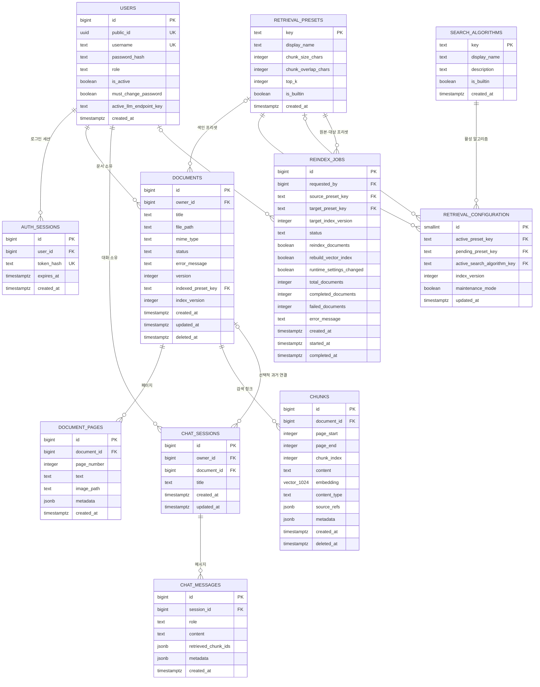

# miniNBLM 데이터베이스 스키마

현재 `main`의 PostgreSQL 스키마를 표와 관계 중심으로 정리한 문서다.

- 실제 스키마 변경 기준: `alembic/versions/`
- 현재 ORM 표현: `app/models/`
- DB 접근 코드: `app/repositories/`
- DB 연결과 세션: `app/database.py`

ORM만 수정하면 운영 DB는 바뀌지 않는다. 테이블이나 열을 변경할 때는 Alembic migration을
같이 추가해야 한다.

---

## 1. 전체 ERD



---

## 2. 사용자와 인증

### `users`

사용자 인증과 모든 사용자 소유 데이터의 기준 테이블이다.

| 열 | 타입 | NULL | 기본값 | 의미 |
|---|---|---:|---|---|
| `id` | `bigint` | 아니요 | identity | 내부 PK와 FK 조인 |
| `public_id` | `uuid` | 아니요 | `gen_random_uuid()` | API에 노출하는 사용자 ID |
| `username` | `text` | 아니요 | 없음 | 로그인 사용자명 |
| `password_hash` | `text` | 아니요 | 없음 | Argon2 비밀번호 hash |
| `role` | `text` | 아니요 | `user` | `user` 또는 `admin` |
| `is_active` | `boolean` | 아니요 | `true` | 로그인 가능 여부 |
| `must_change_password` | `boolean` | 아니요 | `false` | 임시 비밀번호 변경 강제 |
| `active_llm_endpoint_key` | `text` | 예 | 없음 | 사용자가 선택한 LLM endpoint key |
| `created_at` | `timestamptz` | 아니요 | `now()` | 생성 시각 |

제약:

- `public_id` unique
- `username` unique
- `role IN ('user', 'admin')`

`active_llm_endpoint_key`는 DB FK가 아니다. 허용 endpoint 목록은 JSON 설정 파일에서
관리하며, 저장된 key가 사라지면 애플리케이션이 기본 endpoint로 되돌린다.

### `auth_sessions`

브라우저 cookie와 연결되는 로그인 세션이다.

| 열 | 타입 | NULL | 의미 |
|---|---|---:|---|
| `id` | `bigint` | 아니요 | PK |
| `user_id` | `bigint` | 아니요 | `users.id` |
| `token_hash` | `text` | 아니요 | cookie 원문 token의 SHA-256 hash |
| `expires_at` | `timestamptz` | 아니요 | 만료 시각 |
| `created_at` | `timestamptz` | 아니요 | 생성 시각 |

제약과 삭제:

- `token_hash` unique
- `user_id → users.id`
- 사용자 삭제 시 session은 `ON DELETE CASCADE`

인덱스:

- `auth_sessions_user_idx(user_id)`

---

## 3. 문서·페이지·검색 청크

### `documents`

업로드 PDF 원본과 처리 상태를 저장한다.

| 열 | 타입 | NULL | 의미 |
|---|---|---:|---|
| `id` | `bigint` | 아니요 | PK |
| `owner_id` | `bigint` | 아니요 | 소유 사용자 |
| `title` | `text` | 아니요 | 원본 파일명 |
| `file_path` | `text` | 아니요 | 서버 내부 원본 PDF 경로 |
| `mime_type` | `text` | 예 | 업로드 MIME type |
| `status` | `text` | 아니요 | 처리 상태 |
| `error_message` | `text` | 예 | 실패 원인 |
| `version` | `integer` | 아니요 | 문서 레코드 버전, 현재 기본 `1` |
| `indexed_preset_key` | `text` | 예 | 색인에 사용한 프리셋 |
| `index_version` | `integer` | 예 | 색인 전역 버전 |
| `created_at` | `timestamptz` | 아니요 | 업로드 시각 |
| `updated_at` | `timestamptz` | 아니요 | 상태 변경 시각 |
| `deleted_at` | `timestamptz` | 예 | soft-delete 호환 필드 |

상태 흐름:

```text
uploaded → processing → indexed
                      ↘ failed
```

FK:

- `owner_id → users.id ON DELETE RESTRICT`
- `indexed_preset_key → retrieval_presets.key ON DELETE SET NULL`

인덱스:

- `documents_owner_idx(owner_id, created_at)`

### `document_pages`

PDF에서 추출한 페이지 단위 텍스트와 품질 정보를 저장한다.

| 열 | 타입 | NULL | 의미 |
|---|---|---:|---|
| `id` | `bigint` | 아니요 | PK |
| `document_id` | `bigint` | 아니요 | 상위 문서 |
| `page_number` | `integer` | 아니요 | 1부터 시작하는 원본 페이지 |
| `text` | `text` | 예 | layout 기반 추출 텍스트 |
| `image_path` | `text` | 예 | 이미지 저장 호환 필드 |
| `metadata` | `jsonb` | 예 | layout·시각 위험·Vision caption 정보 |
| `created_at` | `timestamptz` | 아니요 | 생성 시각 |

`metadata` 주요 값:

```text
width / height
text_chars
image_count / drawing_count / table_count
visual_evidence_risk
text_only_incomplete
language_hint
text_extraction_mode
vision_caption
```

인덱스:

- `document_pages_document_page_idx(document_id, page_number)`
- `document_pages_text_fts_gin`: `to_tsvector('simple', text)` GIN
- `document_pages_text_trgm_gist`: `text gist_trgm_ops` GiST

### `chunks`

검색과 LLM Context에 사용하는 파생 청크다.

| 열 | 타입 | NULL | 의미 |
|---|---|---:|---|
| `id` | `bigint` | 아니요 | PK |
| `document_id` | `bigint` | 아니요 | 상위 문서 |
| `page_start` | `integer` | 예 | 시작 페이지 |
| `page_end` | `integer` | 예 | 종료 페이지 |
| `chunk_index` | `integer` | 아니요 | 문서 내 순서 |
| `content` | `text` | 아니요 | 검색·생성용 본문 |
| `embedding` | `vector(1024)` | 예 | BGE-M3 임베딩 |
| `content_type` | `text` | 아니요 | `text` 또는 `vision_caption` |
| `source_refs` | `jsonb` | 예 | 원본 문서·페이지 provenance |
| `metadata` | `jsonb` | 예 | 검색과 품질 보조 정보 |
| `created_at` | `timestamptz` | 아니요 | 생성 시각 |
| `deleted_at` | `timestamptz` | 예 | soft-delete 호환 필드 |

`source_refs`와 `metadata`는 목적이 다르다.

```text
source_refs
→ 답변 Source/Page로 돌아가기 위한 원본 위치

metadata
→ 언어, 시각 위험, caption model/version/confidence 등 검색 보조 정보
```

인덱스:

- `chunks_document_idx(document_id)`
- `chunks_page_idx(document_id, page_start, page_end)`
- `chunks_embedding_hnsw`: vector cosine HNSW
- `chunks_content_fts_gin`: `to_tsvector('simple', content)` GIN
- `chunks_content_trgm_gist`: `content gist_trgm_ops` GiST

사용 PostgreSQL extension:

```text
vector
pg_trgm
```

---

## 4. 대화

### `chat_sessions`

사용자 작업공간의 대화 단위다.

| 열 | 타입 | NULL | 의미 |
|---|---|---:|---|
| `id` | `bigint` | 아니요 | PK |
| `owner_id` | `bigint` | 아니요 | 대화 소유 사용자 |
| `document_id` | `bigint` | 예 | 과거 문서 귀속 세션 호환 필드 |
| `title` | `text` | 예 | 질문에서 만든 대화 제목 |
| `created_at` | `timestamptz` | 아니요 | 생성 시각 |
| `updated_at` | `timestamptz` | 아니요 | 최근 메시지 시각 |

현재 작업공간 대화는 특정 PDF 하나에 귀속되지 않는다.

```text
chat_sessions.document_id = NULL
```

검색은 `owner_id` 사용자의 모든 `indexed` 문서를 대상으로 한다.

인덱스:

- `chat_sessions_owner_idx(owner_id, created_at)`
- `chat_sessions_owner_updated_idx(owner_id, updated_at)`

### `chat_messages`

사용자·assistant 발화와 검색 감사를 저장한다.

| 열 | 타입 | NULL | 의미 |
|---|---|---:|---|
| `id` | `bigint` | 아니요 | PK |
| `session_id` | `bigint` | 아니요 | 상위 대화 |
| `role` | `text` | 아니요 | `user` 또는 `assistant` |
| `content` | `text` | 아니요 | 최종 저장 답변 |
| `retrieved_chunk_ids` | `jsonb` | 예 | 최종 검색 Context의 청크 ID 목록 |
| `metadata` | `jsonb` | 예 | 실제 sources와 retrieval trace |
| `created_at` | `timestamptz` | 아니요 | 생성 시각 |

assistant 메시지 `metadata` 예시:

```json
{
  "sources": [],
  "source_selection": "cited",
  "retrieval_trace": {
    "schema_version": 4,
    "query_plan": {},
    "retrieval_events": [],
    "coverage_events": [],
    "outcome": {}
  }
}
```

`retrieved_chunk_ids`는 검색 Context 전체이고, `metadata.sources`는 답변이 실제 인용한
출처만 포함한다.

---

## 5. 검색 설정

### `retrieval_presets`

청킹 크기와 기본 검색 개수를 관리한다.

| 열 | 타입 | NULL | 의미 |
|---|---|---:|---|
| `key` | `text` | 아니요 | PK |
| `display_name` | `text` | 아니요 | 관리자 UI 표시 이름 |
| `chunk_size_chars` | `integer` | 아니요 | 청크 최대 글자 수 |
| `chunk_overlap_chars` | `integer` | 아니요 | 인접 청크 중첩 글자 수 |
| `top_k` | `integer` | 아니요 | 기본 검색 결과 수 |
| `is_builtin` | `boolean` | 아니요 | 내장 프리셋 여부 |
| `created_at` | `timestamptz` | 아니요 | 생성 시각 |

Check constraint:

```text
200 <= chunk_size_chars <= 3500
0 <= chunk_overlap_chars <= chunk_size_chars / 2
1 <= top_k <= 20
```

내장 프리셋:

```text
fine_grained
standard
balanced
broad_context
long_form
```

### `search_algorithms`

관리자가 선택할 검색 알고리즘 메타데이터다.

| 열 | 타입 | NULL | 의미 |
|---|---|---:|---|
| `key` | `text` | 아니요 | PK |
| `display_name` | `text` | 아니요 | UI 표시 이름 |
| `description` | `text` | 아니요 | 알고리즘 설명 |
| `is_builtin` | `boolean` | 아니요 | 내장 여부 |
| `created_at` | `timestamptz` | 아니요 | 생성 시각 |

내장 알고리즘:

```text
dense
keyword
substring
hybrid
```

### `retrieval_configuration`

서비스 전체가 공유하는 singleton 설정이다.

```text
id = 1
```

| 열 | 타입 | NULL | 의미 |
|---|---|---:|---|
| `id` | `smallint` | 아니요 | 항상 `1` |
| `active_preset_key` | `text` | 아니요 | 현재 프리셋 |
| `pending_preset_key` | `text` | 예 | 재인덱싱 중 대상 프리셋 |
| `active_search_algorithm_key` | `text` | 아니요 | 현재 검색 알고리즘 |
| `index_version` | `integer` | 아니요 | 전체 색인 버전 |
| `maintenance_mode` | `boolean` | 아니요 | 문서 write와 chat 차단 여부 |
| `updated_at` | `timestamptz` | 아니요 | 변경 시각 |

제약:

- `id = 1`
- active/pending preset FK는 `ON DELETE RESTRICT`
- active search algorithm FK는 `ON DELETE RESTRICT`

### `reindex_jobs`

프리셋 변경에 따른 전체 재인덱싱 진행과 감사 이력을 저장한다.

| 열 | 타입 | NULL | 의미 |
|---|---|---:|---|
| `id` | `bigint` | 아니요 | PK |
| `requested_by` | `bigint` | 예 | 요청 관리자, 탈퇴하면 NULL |
| `source_preset_key` | `text` | 아니요 | 변경 전 프리셋 |
| `target_preset_key` | `text` | 아니요 | 대상 프리셋 |
| `target_index_version` | `integer` | 아니요 | 완료 후 index version |
| `status` | `text` | 아니요 | 작업 상태 |
| `reindex_documents` | `boolean` | 아니요 | 전체 문서 재처리 여부 |
| `rebuild_vector_index` | `boolean` | 아니요 | vector index 재구축 여부 |
| `runtime_settings_changed` | `boolean` | 아니요 | runtime-only 설정 변경 여부 |
| `total_documents` | `integer` | 아니요 | 전체 문서 수 |
| `completed_documents` | `integer` | 아니요 | 성공 문서 수 |
| `failed_documents` | `integer` | 아니요 | 실패 문서 수 |
| `error_message` | `text` | 예 | job 실패 원인 |
| `created_at` | `timestamptz` | 아니요 | 생성 시각 |
| `started_at` | `timestamptz` | 예 | 시작 시각 |
| `completed_at` | `timestamptz` | 예 | 종료 시각 |

상태 제약:

```text
pending
running
completed
completed_with_errors
failed
```

FK와 삭제:

- `requested_by → users.id ON DELETE SET NULL`
- source/target preset FK
- 사용자 탈퇴 후에도 재인덱싱 감사 이력은 남는다.

인덱스:

- `reindex_jobs_status_idx(status, created_at)`
- `reindex_jobs_requested_by_idx(requested_by, created_at)`

---

## 6. 사용자 격리와 검색 범위

문서와 대화의 사용자 격리 기준:

```text
users.id
├─ documents.owner_id
└─ chat_sessions.owner_id
```

검색 query의 필수 범위:

```text
chunks
→ documents JOIN
→ documents.owner_id = 현재 사용자
→ documents.status = 'indexed'
→ documents.deleted_at IS NULL
→ chunks.deleted_at IS NULL
```

페이지 fallback도 같은 방식으로 `document_pages → documents`를 JOIN해 `owner_id`를
제한한다.

---

## 7. ORM cascade와 DB FK 주의사항

일부 삭제 동작은 DB `ON DELETE`가 아니라 SQLAlchemy relationship 또는 service의 명시적
삭제 순서에 의존한다.

| 관계 | 처리 방식 |
|---|---|
| User → AuthSession | DB `ON DELETE CASCADE` |
| User → Document | DB `ON DELETE RESTRICT`; 계정 서비스가 소유 데이터를 먼저 삭제 |
| User → ChatSession | DB `ON DELETE RESTRICT`; 계정 서비스가 메시지·세션을 먼저 삭제 |
| Document → Page/Chunk | ORM `delete-orphan` 또는 repository 명시 삭제 |
| ChatSession → ChatMessage | ORM `delete-orphan` 또는 repository 명시 삭제 |
| User → ReindexJob requester | DB `ON DELETE SET NULL` |
| Document → indexed preset | DB `ON DELETE SET NULL` |

DB를 직접 수정하거나 삭제 SQL을 추가할 때는 `app/services/auth_service.py`,
`app/repositories/user_repository.py`, `app/services/document_service.py`의 삭제 순서를 같이
확인해야 한다.

---

## 8. Migration 이력

| Revision | 내용 |
|---|---|
| `0001_initial_schema` | documents, pages, chunks, chat과 pgvector HNSW |
| `0002_user_auth_and_ownership` | users, auth sessions, 문서·대화 owner |
| `0003_retrieval_presets` | preset, singleton 설정, reindex job |
| `0004_search_algorithms` | search algorithm 분리, FTS, pg_trgm |
| `0005_chat_session_history` | chat session updated_at과 최근순 index |
| `0006_admin_password_change` | must_change_password |
| `0007_account_deletion` | reindex requester nullable, SET NULL |
| `0008_page_search_indexes` | page FTS·trigram·page order index |
| `0009_user_llm` | 사용자별 active LLM endpoint key |

Migration 실행:

```bash
uv run alembic upgrade head
```

현재 revision 확인:

```bash
uv run alembic current
```

---

## 9. 실제 DB에서 확인

Compose DB 접속:

```bash
docker compose exec db psql -U rag_user -d rag_db
```

테이블 목록:

```sql
\dt
```

주요 테이블 구조:

```sql
\d users
\d auth_sessions
\d documents
\d document_pages
\d chunks
\d chat_sessions
\d chat_messages
\d retrieval_presets
\d search_algorithms
\d retrieval_configuration
\d reindex_jobs
```

전체 schema-only dump:

```bash
docker compose exec -T db \
  pg_dump -U rag_user -d rag_db --schema-only
```

---

## 10. 스키마 변경 체크리스트

- [ ] `app/models/` ORM 수정
- [ ] 새 `alembic/versions/` revision 추가
- [ ] 기존 row의 backfill/default 결정
- [ ] FK의 `ON DELETE` 정책 결정
- [ ] 필요한 unique/check/index 추가
- [ ] repository query와 `owner_id` 범위 수정
- [ ] API schema 변경 여부 확인
- [ ] 계정·문서 삭제 경로 확인
- [ ] integration test 추가
- [ ] `./scripts/test.sh -q` 실행

스키마 관계를 먼저 파악할 때는 이 문서의 ERD를 보고, 실제 변경을 할 때는 ORM과 Alembic을
함께 확인한다.
