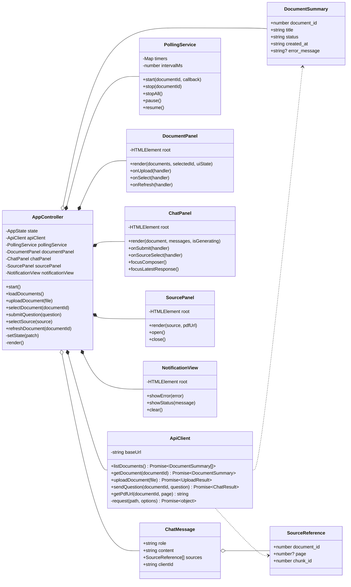
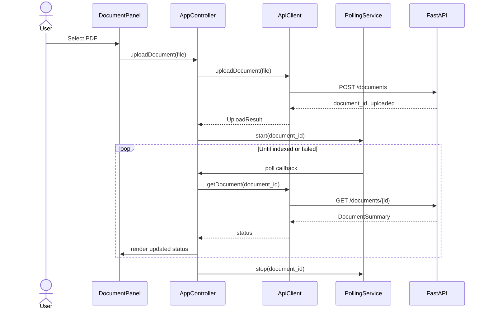
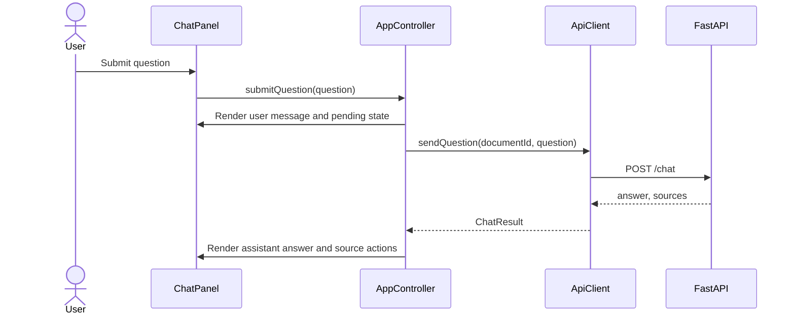
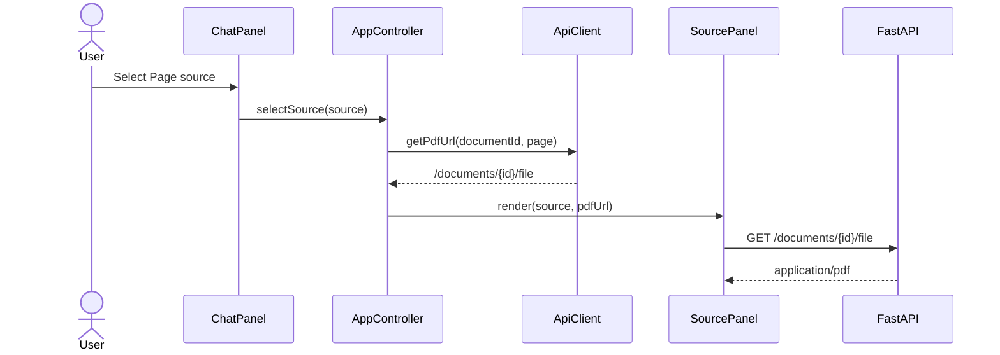

# Nursing PDF RAG Tutor Frontend Design

## 설계 결정 요약

- FE는 React 없이 HTML, CSS, Vanilla JavaScript ES module로 구현한다.
- FastAPI가 UI 정적 파일과 API를 같은 origin에서 제공한다.
- 공개 회원가입과 로그인은 서버 측 세션 및 `HttpOnly` 쿠키를 사용한다.
- 런타임 컨테이너는 `api`, `db`, `embedding`, `llm` 4개를 유지한다.
- `AppController`가 화면 상태와 유스케이스를 조정하고, View는 API를 직접
  호출하지 않는다.
- 문서 처리 상태는 2초 polling으로 확인하고 `indexed` 이후에만 질문을
  허용한다.
- 대화 내용은 MVP에서 브라우저 메모리에만 유지하며, 현재 DB의 대화 저장
  구조를 조회하는 기능은 이후 범위로 둔다.
- 답변 출처는 원본 PDF의 해당 페이지를 브라우저 내장 PDF viewer로 연다.
- 백엔드에 `GET /documents/{document_id}/file`을 추가해 원본 PDF를 inline으로 제공한다.
- 모델 출력은 HTML로 해석하지 않고 `textContent`와 줄바꿈 보존 스타일로
  표시한다.

## 1. Purpose

This document defines the frontend requirements and high-level design for the
Nursing PDF RAG Tutor MVP. The frontend is a single-page interface implemented
with HTML, CSS, and browser-native JavaScript modules. It is served by the
existing FastAPI application and does not introduce another runtime container.

The UI is a learning interface for uploaded nursing course material. It is not
a medical consultation or clinical decision interface.

## 2. Assumptions and Decisions

- Each account has a private document and chat workspace.
- Authentication uses username/password registration and a same-origin session cookie.
- A question targets exactly one selected document.
- Chat history is retained in browser memory for the current page session only.
- The backend continues to persist chat messages, but history retrieval is not
  part of this frontend iteration.
- PDF viewing uses the browser's built-in PDF viewer.
- The application and API use the same origin, so production CORS configuration
  is unnecessary.
- The frontend does not parse arbitrary model output as HTML. Answers are
  rendered as text with preserved line breaks.
- Korean is the primary interface language. Medical abbreviations and source
  page labels may contain English.

## 3. Scope

### 3.0 Implementation Status

2026-08-04 기준으로 MVP Web UI, 정적 파일 serving, PDF 원문 endpoint,
반응형 drawer와 공개 회원가입·로그인·로그아웃 화면을 구현했다. 관리자 전용
청킹 프리셋, 검색 알고리즘 선택 화면과 재인덱싱 상태 polling도 구현했다. Playwright로 인증 전
작업공간 차단, 회원가입, 로그인, 로그아웃, 관리자 프리셋 전환과 모바일
레이아웃과 네 검색 알고리즘의 독립 전환을 검증했다.

이 문서의 요구사항 중 명시적인 실패 작업 재시도 버튼, 새 답변으로의 focus
이동, 문서 수동 refresh는 아직 구현되지 않았다. 현재는 오류 알림 후 사용자가
동일 작업을 다시 수행하며, 문서 상태 갱신은 자동 polling으로 처리한다.

### 3.1 MVP Scope

1. Display existing documents and their indexing status.
2. Upload one PDF at a time.
3. Poll an uploaded document until it becomes `indexed` or `failed`.
4. Select an indexed document as the chat context.
5. Ask a question and display the generated answer.
6. Display source page references returned with the answer.
7. Open the original PDF at a referenced page.
8. Present loading, empty, failure, and retry states.
9. Work on desktop, tablet, and mobile viewports.
10. Always display a concise learning-use safety notice.
11. Delete an indexed or failed document after explicit confirmation.
12. Register, sign in, sign out, and show only the authenticated user's workspace.
13. Allow administrators to activate one of five retrieval presets and monitor reindexing.

### 3.2 Out of Scope

- Email verification and password recovery
- Multi-document retrieval in one question
- Persisted chat history navigation
- Document version management
- Token streaming
- OCR or image-based page analysis
- User feedback and answer scoring
- Markdown extensions or arbitrary HTML rendering
- Client-side PDF rendering with PDF.js
- Offline operation

## 4. Functional Requirements

| ID | Requirement | Acceptance condition |
|---|---|---|
| FR-01 | Load document list | `GET /documents` is called when the page opens. |
| FR-02 | Upload PDF | A PDF is sent as multipart form data to `POST /documents`. |
| FR-03 | Validate upload | Non-PDF files are rejected before upload and by the API. |
| FR-04 | Show processing state | `uploaded` and `processing` documents show a busy state and cannot be queried. |
| FR-05 | Poll processing | The selected/new document is checked every 2 seconds until terminal status. |
| FR-06 | Select document | Only an `indexed` document enables the question composer. |
| FR-07 | Submit question | Empty or whitespace-only questions are rejected locally. |
| FR-08 | Prevent duplicate request | The composer is disabled while one answer is being generated. |
| FR-09 | Show answer | The assistant answer preserves line breaks and wraps long terms safely. |
| FR-10 | Show sources | Each source shows a page label and opens the corresponding PDF page. |
| FR-11 | Show failure | Upload, indexing, retrieval, and generation failures are distinguishable. |
| FR-12 | Retry recoverable action | Document refresh and failed question submission can be retried. |
| FR-13 | Safety notice | The interface states that it is a course-material learning aid, not a clinical tool. |
| FR-14 | Delete document | Confirm deletion, remove related data, and update the active selection. |
| FR-15 | Register and sign in | A valid account receives an `HttpOnly` session cookie and enters its workspace. |
| FR-16 | Isolate workspace | Documents, PDF sources, questions, and deletion are limited to the signed-in owner. |
| FR-17 | Sign out | The server session is revoked and the authentication view replaces the workspace. |

## 5. Non-functional Requirements

### 5.1 Usability

- The first screen is the usable application, not a landing page.
- The selected document and its status are always visible while chatting.
- A new user can upload a PDF and ask a question without navigating to another
  page.
- Status changes do not shift the primary layout.

### 5.2 Accessibility

- All form controls have explicit labels.
- Upload, indexing, and answer status changes use an `aria-live` region.
- All actions are keyboard accessible.
- Focus moves to the relevant error or new assistant response when appropriate.
- Color is not the only indicator of status.
- Text and controls meet WCAG AA contrast targets.

### 5.3 Security

- Model output is assigned through `textContent`, never unsanitized `innerHTML`.
- The client does not construct server file-system paths.
- PDF URLs use only numeric document and page identifiers.
- File type and configurable maximum size are validated on both client and server.
- API error details are mapped to user-safe messages; raw stack traces are never
  displayed.
- Passwords are never stored or sent back to the client; the server stores Argon2id hashes.
- Session tokens are unavailable to JavaScript because they use `HttpOnly` cookies.

### 5.4 Performance

- No frontend framework or bundling step is required.
- Initial static assets should remain small enough to load immediately on a LAN.
- Polling runs only for non-terminal documents and stops when the page is hidden.
- Repeated document list refreshes do not recreate unchanged chat messages.

## 6. Information Architecture

### 6.1 Desktop Layout

```text
+-----------------------------------------------------------------------+
| Nursing PDF Tutor                         Learning-use safety notice   |
| Signed-in user                                              Sign out   |
+-------------------+--------------------------------+------------------+
| Documents         | Chat                           | Source PDF       |
|                   |                                |                  |
| Upload action     | Selected document              | Selected page    |
| Document list     | Messages                       | PDF viewer       |
| Status indicators |                                |                  |
|                   | Question composer              |                  |
+-------------------+--------------------------------+------------------+
```

- Document panel: fixed responsive width, optimized for scanning.
- Chat panel: primary flexible workspace.
- Source panel: shown when a source is selected; otherwise displays an empty
  source state.

### 6.2 Mobile Layout

- Chat remains the primary surface.
- Documents open in a left-side drawer.
- Sources open in a full-height panel or a new browser tab when embedded PDF
  viewing is unavailable.
- The question composer remains attached to the bottom of the chat surface but
  must not cover messages or mobile browser controls.

## 7. UI State Model

```text
AppState
  documents: DocumentSummary[]
  selectedDocumentId: number | null
  conversations: Map<documentId, ChatMessage[]>
  selectedSource: SourceReference | null
  isLoadingDocuments: boolean
  isUploading: boolean
  deletingDocumentId: number | null
  isGenerating: boolean
  error: UiError | null
```

Document status behavior:

| API status | UI behavior |
|---|---|
| `uploaded` | Show queued state; start polling. |
| `processing` | Show indexing state; keep polling. |
| `indexed` | Enable selection and chat. |
| `failed` | Show error details and refresh action. |
| `deleted` | Hide from the active list. |

The controller applies state updates. Views receive state fragments and emit
semantic events; views do not call the API directly.

## 8. Frontend Structure

```text
app/static/
├── index.html
├── styles/
│   ├── tokens.css
│   ├── layout.css
│   └── components.css
└── js/
    ├── main.js
    ├── app-controller.js
    ├── api-client.js
    ├── polling-service.js
    ├── state.js
    ├── formatters.js
    └── views/
        ├── auth-view.js
        ├── document-panel.js
        ├── chat-panel.js
        ├── source-panel.js
        ├── admin-view.js
        └── notification-view.js
```

### 8.1 Module Responsibilities

| Module | Responsibility |
|---|---|
| `main.js` | Resolve DOM roots, create dependencies, start the application. |
| `auth-view.js` | Coordinate login/register mode, validation state, and authentication form events. |
| `app-controller.js` | Own application state and coordinate all workflows. |
| `api-client.js` | Implement typed-by-contract HTTP operations and normalized errors. |
| `polling-service.js` | Manage one polling timer per active document. |
| `state.js` | Define initial state and immutable update helpers. |
| `formatters.js` | Format dates, statuses, pages, and safe display strings. |
| `document-panel.js` | Render upload control, document list, selection, and status. |
| `chat-panel.js` | Render messages and question composer; emit submit/source events. |
| `source-panel.js` | Render the PDF URL for the selected source page. |
| `notification-view.js` | Render transient errors and announce status changes. |
| `admin-view.js` | Render chunking presets, search algorithms, maintenance state, job progress, and retry action. |

## 9. High-level Class Diagram

The diagram describes conceptual ES module classes. API DTOs are plain objects,
not behavior-rich domain classes.



## 10. Main Interaction Sequences

### 10.1 Upload and Indexing



### 10.2 Ask a Question



### 10.3 Open a Source



## 11. API Contract and Backend Gaps

Existing endpoints used as-is:

| Method | Endpoint | Purpose |
|---|---|---|
| `GET` | `/health` | Basic API availability |
| `GET` | `/documents` | Initial list and manual refresh |
| `POST` | `/documents` | PDF upload |
| `GET` | `/documents/{id}` | Indexing status polling |
| `DELETE` | `/documents/{id}` | Delete a terminal-state document and related data |
| `POST` | `/chat` | Retrieval and answer generation |

Required endpoint:

```http
GET /documents/{document_id}/file
```

Expected behavior:

- Return the stored original PDF using `FileResponse`.
- Return `404` when the document or file does not exist.
- Set `Content-Type: application/pdf`.
- Set a safe download filename derived from the document title.
- Do not accept a client-provided file path.

Recommended backend hardening before UI release:

- Add a configurable maximum upload size.
- Map embedding and vLLM connection failures to `503 Service Unavailable`.
- Return stable API error codes in addition to human-readable details.
- Consider adding `excerpt` to `SourceRef` after the MVP if source inspection
  without opening the PDF becomes important.

## 12. Error Mapping

| Condition | UI response |
|---|---|
| Network unavailable | Keep user input, show retry action. |
| `400` upload | Explain accepted file type/size. |
| `404` document/PDF | Remove stale selection and refresh documents. |
| `409` processing | Refresh status and keep composer disabled. |
| `422` invalid question | Keep question text and request correction. |
| `500` unexpected error | Show generic failure with retry; log technical detail to console. |
| `503` model unavailable | Explain that the AI service is temporarily unavailable. |

## 13. Implementation Phases

### Phase 1: Backend support

- Add the original PDF endpoint.
- Add upload-size configuration and safe API error handling.
- Add endpoint tests for valid, missing, and invalid document IDs.

### Phase 2: Static application shell

- Add static files and FastAPI static serving.
- Implement responsive three-region layout and mobile drawers.
- Add empty, loading, and safety-notice states.

### Phase 3: Document workflow

- Implement list, upload, selection, and polling.
- Handle processing and failed documents.

### Phase 4: Chat and sources

- Implement per-document in-memory conversations.
- Implement question submission, retry, and source actions.
- Implement embedded PDF view and mobile new-tab fallback.

### Phase 5: Verification

- Unit-test API normalization and state transitions.
- Run Playwright flows at desktop and mobile viewports.
- Verify keyboard navigation, wrapping, focus, and non-overlapping layout.
- Run the complete Docker Compose smoke test.

## 14. MVP Acceptance Criteria

The frontend MVP is complete when all of the following are true:

1. A user can open `/`, upload a PDF, and observe indexing progress.
2. Chat remains disabled until the selected document is indexed.
3. A question produces an answer and at least one source when retrieval succeeds.
4. Selecting a source opens the correct PDF and requested page.
5. A failed upload, indexing job, or LLM call produces an actionable UI state.
6. The interface remains usable at 360px mobile and 1440px desktop widths.
7. Model output cannot inject executable HTML into the page.
8. API, DB, embedding, and LLM remain the only runtime containers.
